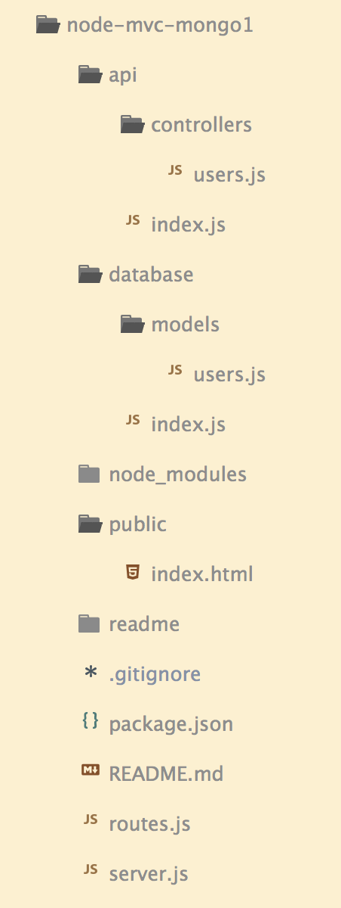

----------------------

# ARCHITECTURE MVC
Découper les différentes étapes d'une architecture MVC avec node et mongo

Ce chapitre s'inscrit dans le module **Node MVC et MongoDB**

1. [ ] [Node MVC MongoDB étape 1](https://github.com/simplonco/node-mvc-mongodb-step1)
    
2. [x] [Node MVC MongoDB étape 2](https://github.com/simplonco/node-mvc-mongodb-step2)
    
3. [ ] [Node MVC MongoDB étape 3](https://github.com/simplonco/node-mvc-mongodb-step3)

Il existe un [module identique avec SQLite](https://github.com/simplonco/node-mvc-sqlite-step1).

Vous pouvez trouver ce module dans les parcours suivants :

+ Développeur Web Fullstack


------------
MVC, qu’est-ce que c’est ?

Le design pattern **Model-View-Controller** est une façon d’organiser son code.

Pour gagner en :
+ lisibilité
+ sécurité
+ scalabilité

Mais concrètement, c’est quoi une view, un model, un controller ?

Voyons ça en nous aidant de l’exemple d’un restaurant.


Imaginons que je commande un plat, je vais request ce plat (_url_) à mon serveur.
+ Le serveur pourra alors envoyer (_router_) cette commande à un cuisinier (_controller_).
	```
	express.get(’users’, userController);
	//serveur.order(’plat’, cuisinier);
	```
	
+ Il va utiliser la recette (_method_) correspondante au plat (_url_).
	```
	express.get(’users’, userController.find);
	//serveur.order(’plat’, cuisinier.recette);
	```
	
+ Le cuisinier pourra utiliser des ingrédients (_data_) fournit par un grossiste (_db engine_) pour répondre à cette commande (_request_).
	```
	db.users.find(...).then(...)
	```
+ Et le serveur pourra renvoyer le plat au client (_view_);
	```
	res.send(...)
	```

On va donc commencer par bien **séparer les différents espaces** ( salle, cuisine, et grossiste ) pour mieux organiser notre code.
Ne pas enfermer notre server et son menu (route) dans un des espaces afin qu’il puisse accéder librement à tous.
On a donc nos dossiers :
+ _public_ qui contient nos _views_ (enfin pas tout à fait, on verra pourquoi après)
+ _api_ qui contient nos _controllers_
+ et _database_ qui contient _nos models_
Et nos fichiers _server.js_ et _routes.js_ à l’extérieur. 



Mais comment exactement s’éxecute le traitement de cette requête ?
